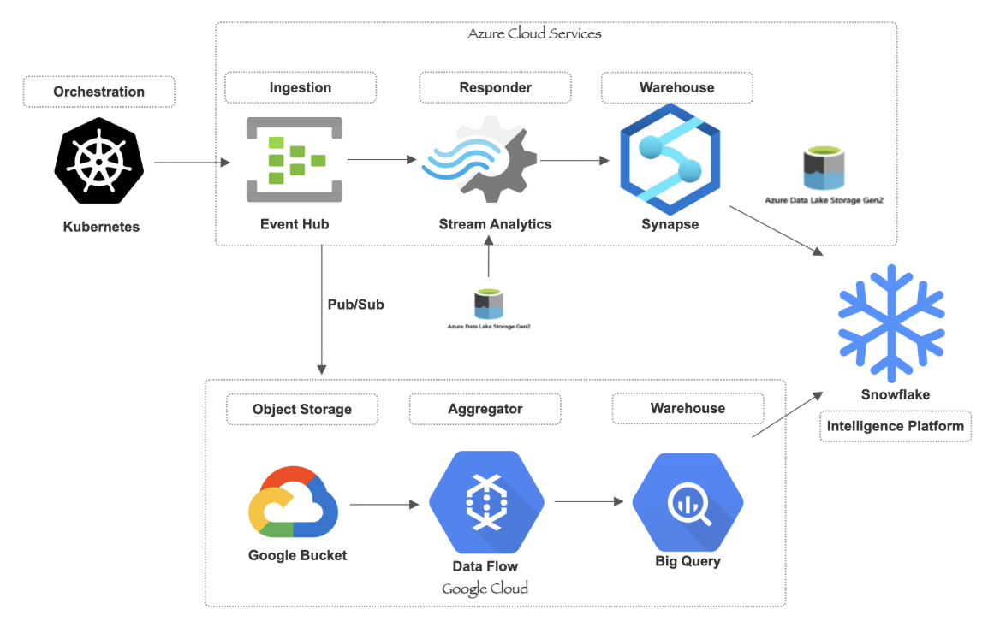

# Energy Grid Monitoring System
### Azure Batch 3 — Team 7 | Baibhav Kumar · Gautam Shrivas · Utkarsh Kumar

---

## Problem Statement

PowerGrid Co operates an electricity distribution network across five US regions — Northeast, Southeast, Midwest, West, and Southwest. The network consists of 50 nodes including Solar Farms, Wind Farms, Hydro Plants, Coal Plants, Gas Plants, Nuclear Plants, Substations, and Distribution Hubs.

The company had no automated monitoring, alerting, or analytics platform. Grid faults were detected hours after occurrence. Planning teams had no visibility into consumption trends, renewable generation mix, or capacity utilisation.

**This project builds a multi-cloud pipeline that:**
- Detects grid faults in under 30 seconds via real-time alerting
- Aggregates regional consumption and generation data for planning teams
- Delivers long-term anomaly detection and trend analysis via Snowflake

---

## Architecture




**Azure path** — real-time alerting with sub-30-second latency. Ops team consumer.

**GCP path** — batch aggregation by region and node type. Planning team consumer.

> **Note on GCP path:** In this implementation, data flows from Google Cloud Storage directly into Dataflow. In a production pipeline, the GCS source would be replaced with a Pub/Sub connection receiving events from Event Hub — the Dataflow pipeline and all downstream logic stays exactly the same.

---

## Repository Structure

```
macro_project_a3t7/
├── Task 1 Kubernetes/
│   ├── Dockerfile
│   ├── grid_producer.py
│   ├── requirements.txt
│   ├── deployment.yaml
│   ├── hpa.yaml
│   ├── configmap.yaml
│   ├── secret.yaml
│   ├── power_consumption.csv
│   ├── HPA Result.png
│   └── Kubectl getpod result.png
│
├── Task 2 Stream Analytics/
│   ├── stream_analytics.sql
│   └── Result_Stream Analytics/
│       ├── alert detection.png
│       ├── overvoltage_alert.webp
│       ├── peak_demand_window.webp
│       ├── renewable_generation_mix.png
│       └── rolling_avg.webp
│
├── Task 3 Synapse/
│   ├── SQL Script_1.sql
│   ├── SQL Script_2.sql
│   ├── SQL Script_3.sql
│   └── Task 3 Synapse_Results/
│       ├── 7 days Rolling average.png
│       ├── Avg, Min, Max Consumption.webp
│       ├── Renewable Generation Mix %.png
│       └── Top 5 Outage Node.png
│
├── Task 4 GCP Dataflow/
│   ├── pipeline.py
│   ├── config.py
│   ├── parse.py
│   ├── enrich.py
│   ├── aggregate.py
│   ├── schema.py
│   ├── grid_nodes.csv
│   ├── power_consumption.csv
│   └── GCP Screenshots/
│       ├── Bigquery_Schema.png
│       ├── Bigquery Data Preview.png
│       ├── Bigquery Table Details.png
│       ├── Dataflow Graph.png
│       ├── Dataflow_Table_View.png
│       ├── Input Files.png
│       ├── Sample Query.png
│       └── Sample Query 1.png
│
└── Task 5 Snowflake/
    ├── Task 5 Snowflake Using Azure.sql
    ├── Task 5 Snowflake using GCP.sql
    ├── 1) Anamoly Count.png
    ├── 2) Spike.png
    ├── 3) Moving average.png
    └── 4) Under utilization.png
```

---

## Dataset

Three CSV files represent a regional power grid network.

| File | Rows | Description |
|------|------|-------------|
| `grid_nodes.csv` | 50 | Node master data — type, region, capacity, renewable flag |
| `power_consumption.csv` | 5,000 | Hourly sensor readings — consumption, generation, voltage, frequency, outage flag |
| `alerts.csv` | 500 | Historical alert records — type, severity, resolution status |

---

## Task 1 — Kubernetes: Producer Deployment

**What it does:** Deploys a Python event producer to Kubernetes that replays `power_consumption.csv` as a live stream to Azure Event Hub. Configured with HPA to scale between 1 and 5 replicas based on CPU utilisation.

### Files

| File | Purpose |
|------|---------|
| `grid_producer.py` | Reads CSV, groups events by `node_id` partition key, publishes batches to Event Hub |
| `Dockerfile` | Packages the producer and dependencies into a Docker image |
| `deployment.yaml` | Kubernetes Deployment — 1 replica, CPU/memory limits, liveness and readiness probes |
| `hpa.yaml` | HorizontalPodAutoscaler — scales 1→5 replicas at 70% CPU |
| `configmap.yaml` | Non-sensitive config — Event Hub name, batch size, replay loop flag |
| `secret.yaml` | Base64-encoded Event Hub connection string, mounted as environment variable |
| `requirements.txt` | `azure-eventhub==5.11.7` |

### Key Design Decisions

**Partition key = `node_id`**
All readings from the same node go to the same Event Hub partition. This preserves per-node message ordering even when multiple producer pods are running simultaneously.

**Liveness probe on `/health`**
Kubernetes hits port 8080 every 15 seconds. Three consecutive failures trigger an automatic pod restart — handles silent hangs without human intervention.

**HPA stabilisation windows**
Scale-up stabilisation is 60 seconds (act fast under load). Scale-down stabilisation is 300 seconds (avoid premature capacity removal if load spikes again).

**ConfigMap vs Secret**
Non-sensitive config (Event Hub name, batch size) lives in ConfigMap. The connection string — which contains credentials — lives in a Secret. Both are injected as environment variables at runtime. Credentials never appear in source code.

### Prerequisites

```bash
# Minikube running
minikube start

# Docker image built
docker build -t grid-event-producer:1.0 .
minikube image load grid-event-producer:1.0
```

### Deployment

```bash
kubectl apply -f configmap.yaml
kubectl apply -f secret.yaml
kubectl apply -f deployment.yaml
kubectl apply -f hpa.yaml
```

### Verify

```bash
# Pod should show 1/1 Running
kubectl get pods

# HPA should show target 70% CPU, min 1, max 5
kubectl get hpa
```

---

## Task 2 — Azure Stream Analytics: Grid Monitoring Queries

**What it does:** Runs continuous SQL queries over the Event Hub stream to detect faults, compute peak demand windows, and track renewable generation mix. All alerts fire within 30 seconds end-to-end.

### Queries

**2.1 — Outage and Alert Detection**
Detects `outage_flag = true` or frequency deviating outside 49.8–50.2 Hz. Routes output to `dbo.grid_alerts_realtime` in Azure SQL.

**2.2 — Peak Demand Windows**
15-minute tumbling window computing total `consumption_mwh` per region. Flags windows exceeding 80% of total regional capacity. Hopping window (15m duration, 5m hop) for per-node rolling average smoothing.

**2.3 — Renewable Generation Mix**
1-hour tumbling window computing `renewable_generation_mwh / total_generation_mwh * 100` per region. Joins streaming input with `grid_nodes` reference data on `node_id` to access `is_renewable` flag. Output to ADLS Gen2 partitioned by date.

### Configuration

| Parameter | Value |
|-----------|-------|
| Output watermark delay | 10 seconds |
| Late arrival tolerance | 20 seconds |
| Reference inputs | `grid-nodes-ref`, `nominal-voltages-ref`, `region-capacity-ref` |

---

## Task 3 — Azure Synapse: Time-Series Analytics Warehouse

**What it does:** Loads grid readings and alert data into a Dedicated SQL Pool optimised for time-series queries. Uses HASH distribution on `node_id`, hourly partitioning, and clustered columnstore indexes.

### Table Design

**`grid_readings`** — HASH distributed on `node_id`. DATE + HOUR partitioning for time-range query pruning. Clustered columnstore index for compressed columnar storage — significantly reduces I/O for aggregation queries scanning millions of rows.

**`alerts`** — REPLICATE distribution (small lookup table). Grows to millions of rows in production — query patterns filter by `node_id`, `alert_type`, and date range.

### Queries

| Query | Approach |
|-------|----------|
| Hourly AVG/MIN/MAX consumption per node | `DATEPART` to extract hour, grouped aggregation |
| Top 5 nodes by total outage duration | Islands pattern — groups consecutive `outage_flag = true` readings |
| Daily renewable generation % per region | JOIN readings × nodes, SUM renewable / total × 100 |
| 7-day rolling consumption average | `ROWS BETWEEN 6 PRECEDING AND CURRENT ROW` window function |

---

## Task 4 — GCP Dataflow: Regional Aggregation Pipeline

**What it does:** Apache Beam pipeline that reads two CSVs from GCS, joins them on `node_id`, aggregates readings by `(region, node_type, date)`, and writes results to a DATE-partitioned BigQuery table.

### Pipeline Architecture

```
ReadNodes (GCS)        ReadReadings (GCS)
      │                       │
 ParseNodes              ParseReadings
      │                       │
      └──────── CoGroupByKey (JOIN on node_id) ────────┘
                              │
                        EnrichReadings
                   (attach region, node_type, is_renewable)
                              │
                        MakeGroupKey
                   (region, node_type, date)
                              │
                         GroupByKey
                              │
                           Aggregate
                    (6 metrics per group)
                              │
                       WriteToBigQuery
                  (DATE partitioned, clustered)
```

### Module Breakdown

| File | Responsibility |
|------|---------------|
| `config.py` | GCS paths, BigQuery table ID, Dataflow worker settings |
| `parse.py` | Parses raw CSV lines into `(node_id, dict)` tuples. Filters malformed rows. |
| `enrich.py` | After JOIN — attaches `region`, `node_type`, `is_renewable` to each reading |
| `aggregate.py` | Computes 6 metrics per `(region, node_type, date)` group |
| `schema.py` | BigQuery table schema definition |
| `pipeline.py` | Assembles all transforms, configures Dataflow runner, submits job |

### Aggregation Metrics

| Metric | Calculation |
|--------|------------|
| `total_consumption_mwh` | SUM of consumption per group |
| `total_generation_mwh` | SUM of generation per group |
| `net_flow_mwh` | SUM of net flow per group |
| `avg_power_factor` | MEAN of power factor per group |
| `outage_count` | COUNT of rows where `outage_flag = true` |
| `renewable_generation_mwh` | SUM of generation where `is_renewable = true` |

### BigQuery Output Table: `regional_grid_summary`

| Column | Type | Notes |
|--------|------|-------|
| `region` | STRING | Northeast / West / Midwest / Southeast / Southwest |
| `node_type` | STRING | Solar Farm / Wind Farm / Coal Plant / etc. |
| `date` | DATE | Partition key — YYYY-MM-DD |
| `total_consumption_mwh` | FLOAT64 | |
| `total_generation_mwh` | FLOAT64 | |
| `net_flow_mwh` | FLOAT64 | Negative = exporting to grid |
| `avg_power_factor` | FLOAT64 | Efficiency 0.75–1.0 |
| `outage_count` | INTEGER | |
| `renewable_generation_mwh` | FLOAT64 | Zero for Coal / Gas groups |
| `reading_count` | INTEGER | Rows aggregated into this record |

Table is **DATE partitioned** and **clustered on `(region, node_type)`** — queries filtering by date and region scan only relevant partitions and clusters, not the full table.

### Setup

```bash
# Create virtual environment
python -m venv task-4-venv
source task-4-venv/bin/activate

# Install dependencies
pip install apache-beam[gcp]

# Authenticate
gcloud auth application-default login
gcloud config set project macro-project-a3t7
```

### Running the Pipeline

```bash
# Test locally — zero cost, runs on DirectRunner
python pipeline.py --runner=DirectRunner

# Submit to Dataflow
python pipeline.py --runner=DataflowRunner
```

### Environment Configuration (`config.py`)

```python
PROJECT_ID   = "macro-project-a3t7"
REGION       = "us-central1"
BUCKET       = "macro-bucket-macro-project-a3t7"
NODES_CSV    = f"gs://{BUCKET}/energy/grid_nodes.csv"
READINGS_CSV = f"gs://{BUCKET}/energy/power_consumption.csv"
MACHINE_TYPE = "e2-standard-2"
MAX_WORKERS  = 2
```

### Verify Output

```sql
-- Row count — expect ~3,923 rows
SELECT COUNT(*) FROM `macro-project-a3t7.energy_grid.regional_grid_summary`;

-- Top renewable generators
SELECT region, node_type, SUM(renewable_generation_mwh) AS total_renewable
FROM `macro-project-a3t7.energy_grid.regional_grid_summary`
GROUP BY region, node_type
ORDER BY total_renewable DESC
LIMIT 5;
```

**Expected results:**

| Region | Node Type | Renewable MWh |
|--------|-----------|--------------|
| Northeast | Solar Farm | 139,061 |
| West | Wind Farm | 114,874 |
| Southeast | Solar Farm | 97,073 |
| Midwest | Hydro Plant | 89,365 |

### Monitor

GCP Console → Dataflow → Jobs → `energy-grid-aggregation`

---

## Task 5 — Snowflake: Anomaly Detection and Trend Analysis

**What it does:** Loads grid data into Snowflake and applies time-series analytical functions to detect consumption anomalies, demand spikes, and long-term generation trends.

### Setup

```sql
CREATE DATABASE ENERGYGRID;
CREATE SCHEMA ENERGYGRID.OPS;
```

Tables created: `GRID_NODES` (50 rows), `POWER_CONSUMPTION` (5,000 rows), `ALERTS` (500 rows).

Data loaded via `COPY INTO` from either Azure ADLS Gen2 or GCS external stage — see `Task 5 Snowflake Using Azure.sql` and `Task 5 Snowflake using GCP.sql` for both variants.

### Materialised View: `HOURLY_NODE_SUMMARY`

Pre-aggregates consumption and generation by `node_id` and hour. Used by monitoring dashboards that run the same aggregation query hundreds of times per day. Snowflake maintains the view incrementally — dashboard queries hit pre-computed results instead of scanning 5,000 raw rows each time.

### Analytical Queries

**Z-Score Anomaly Detection**
Flags readings where `consumption_mwh` is more than 3 standard deviations from the node's own historical mean. Uses `STDDEV` and `AVG` window functions partitioned by `node_id` with `QUALIFY` clause for clean filtering.

**Demand Spike Detection (LAG)**
Computes hour-over-hour change in consumption using `LAG()`. Flags readings where the change exceeds 50% of the previous hour's value — detects sudden demand spikes in near-real-time.

**30-Day Moving Average**
Computes rolling 30-day average of daily total `generation_mwh` per region using `ROWS BETWEEN 29 PRECEDING AND CURRENT ROW` window frame over daily aggregated data.

**Capacity Utilisation**
Calculates `AVG(consumption_mwh) / capacity_mw * 100` per node. Flags nodes operating below 20% average utilisation — decommissioning candidates for the planning team.

---

## Results Summary

| Metric | Value |
|--------|-------|
| Grid nodes monitored | 50 |
| US regions covered | 5 |
| Hourly readings processed | 5,000 |
| BigQuery aggregated rows | 3,923 |
| Real-time alert latency | < 30 seconds |
| Technologies integrated | 6 |
